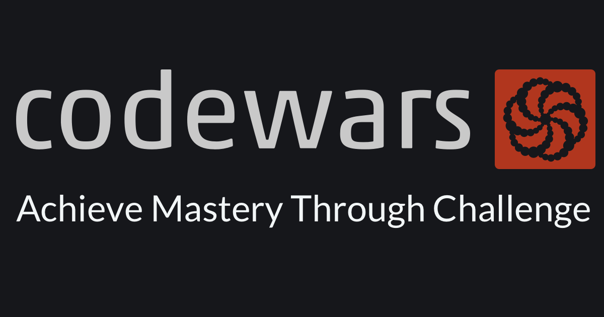
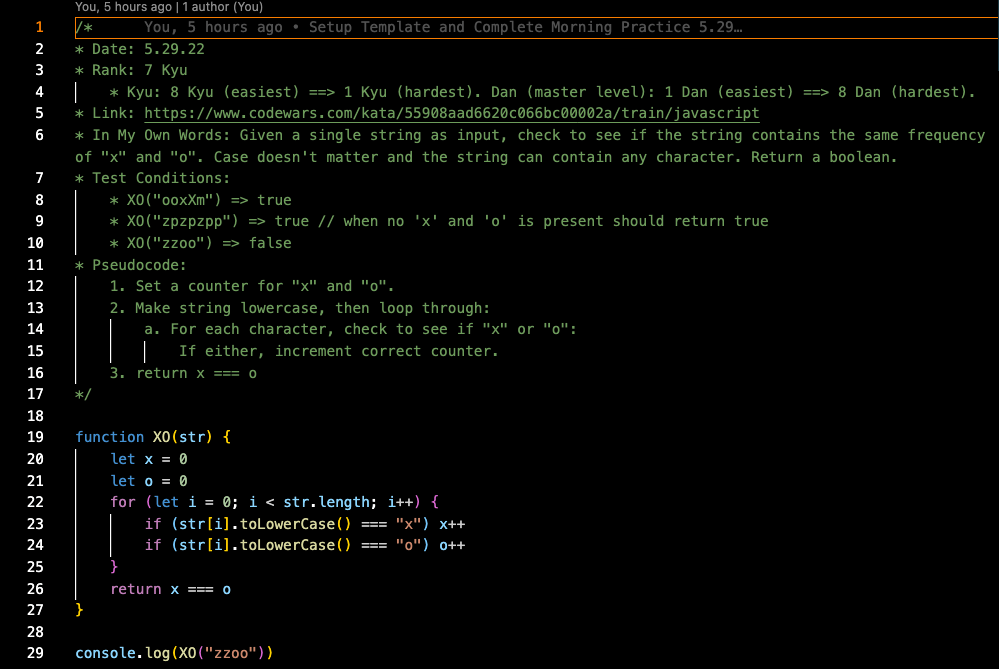

[![LinkedIn][linkedin-shield]][linkedin-url]

<!-- PROJECT LOGO -->
 

  

 
<h1 align="center">Algorithm Practice</h3>

  

    The purpose of this repo is to log problems I have solved using Codewars, along with notes on how I approached the problem. All problems in the <code>with-notes</code> folder include info from the following template:
    <ul align="left">
      <li><strong>Date</strong>: The date the problem was attempted</li>
      <li><strong>Rank</strong>: The difficulty level Codewars assigned the problem</li>
      <ul>
        <li><em><u>Kyu</u></em>: 8 Kyu (easiest) ==> 1 Kyu (hardest)</li>
        <li><em><u>Dan (Master Level)</u></em>: 1 Dan (easiest) ==> 8 Dan (hardest)</li>
      </ul>
      <li><strong>Link</strong>: A link to the problem</li>
      <li><strong>In My Own Words</strong>: The problem rephrased in my own words</li>
      <li><strong>Test Conditions</strong>: Several examples of successful input/output</li>
      <li><strong>Pseudocode</strong>: A pseudocode breakdown written before attempting the solution</li>
      <li><strong>Notes After Attempt</strong>: Notes on my solution versus the "Best Practices" solution</li>
    </ul> 
  

   

<!-- TABLE OF CONTENTS -->

  
Table of Contents

  <ol>
    <li>
      <a href="#about-the-project">About The Project</a>
      <ul>
        <li><a href="#built-with">Built With</a></li>
      </ul>
    </li>
    <li><a href="#contact">Contact</a></li>
  </ol>

 

<!-- ABOUT THE PROJECT -->
## About The Project

  

The folders in the `with-notes` directory are organized by year-month. Navigate to the most recent month to see problems I've completed recently. Any feedback is greatly appreciated! 

(<a href="#top">back to top</a>)

### Built With

* [JavaScript](https://www.javascript.com/)
* [Ruby](https://www.ruby-lang.org/en/)
* [Python](https://www.python.org/)

(<a href="#top">back to top</a>)

<!-- CONTACT -->
## Contact

Jonathan Bryant - jbryant9@gmail.com, spectrum19tech@gmail.com

Project Link: [https://github.com/Jonathan-Bryant19/algo-practice](https://github.com/Jonathan-Bryant19/algo-practice)

(<a href="#top">back to top</a>)

<!-- MARKDOWN LINKS & IMAGES -->
<!-- https://www.markdownguide.org/basic-syntax/#reference-style-links -->

[linkedin-shield]: https://img.shields.io/badge/-LinkedIn-black.svg?style=for-the-badge&logo=linkedin&colorB=555
[linkedin-url]: https://www.linkedin.com/in/jonathan-bryant19/